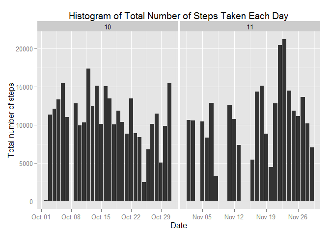
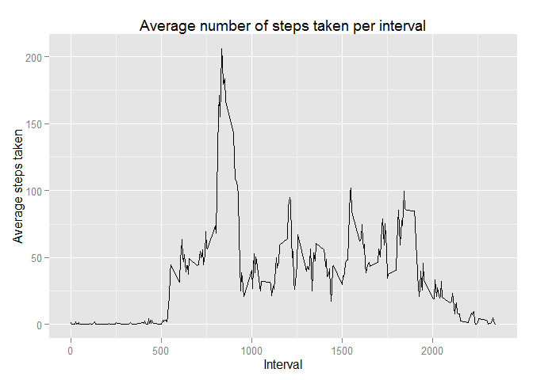
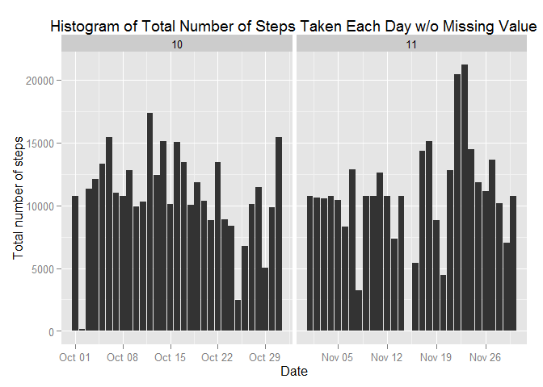
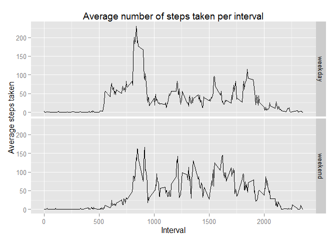

# Reproducible Research: Peer Assessment 1


## Loading and preprocessing the data

```r
setwd("D:/project/assignment5_1/RepData_PeerAssessment1/")
unzip("activity.zip", overwrite=TRUE)
data <- read.csv(file="activity.csv",colClasses=c("integer", "Date", "integer"))
data$month <- as.numeric(format(data$date, "%m"))
head(data)
```

```
##   steps       date interval month
## 1    NA 2012-10-01        0    10
## 2    NA 2012-10-01        5    10
## 3    NA 2012-10-01       10    10
## 4    NA 2012-10-01       15    10
## 5    NA 2012-10-01       20    10
## 6    NA 2012-10-01       25    10
```

## What is mean total number of steps taken per day?
Make a histogram of the total number of steps taken each day

```r
library(ggplot2)
ggplot(data, aes(date, steps)) + geom_bar(stat = "identity") + facet_grid(. ~ month, scales = "free") + labs(title = "Histogram of Total Number of Steps Taken Each Day",x = "Date", y = "Total number of steps")
```

```
## Warning: Removed 576 rows containing missing values (position_stack).
```

```
## Warning: Removed 1728 rows containing missing values (position_stack).
```

 

Calculate and report the mean and median of the total number of steps taken per day

```r
options(scipen = 1)
stepsPerDay <- aggregate(steps ~ date, data = data, sum, na.rm = TRUE)
x <-mean(stepsPerDay$steps)
y <-median(stepsPerDay$steps)
```

Mean of the total number of steps taken per day is 10766.1886792

Median of the total number of steps taken per day is 10765

## What is the average daily activity pattern?
Make a time series plot (i.e. type = "l") of the 5-minute interval (x-axis) and the average number of steps taken, averaged across all days (y-axis)

```r
AveStepsPerInterval <- aggregate(steps ~ interval, data = data, mean, na.rm = TRUE)
library(ggplot2)
ggplot(AveStepsPerInterval, aes(x = interval, y = steps)) + geom_line() + ggtitle("Average number of steps taken per interval") + 
    xlab("Interval") + ylab("Average steps taken")
```

 

5-minute interval at **835**, on average across all the days in the dataset, contains the maximum number of steps *206.1698*

```r
AveStepsPerInterval [which.max(AveStepsPerInterval$steps),]
```

```
##     interval    steps
## 104      835 206.1698
```

## Imputing missing values
Calculate and report the total number of missing values in the dataset (i.e. the total number of rows with NAs)

```r
sum(is.na(data))
```

```
## [1] 2304
```

**Mean for that 5-minute interval** been used in order to fill in all of the missing values in the dataset.

```r
getMeanSteps <- function(interval) {
    AveStepsPerInterval[which(AveStepsPerInterval$interval == interval), ]$steps
}
newdata <- data
for (i in 1:length(newdata$steps)) {
    newdata$steps[i] <- ifelse(is.na(newdata$steps[i]), getMeanSteps(newdata$interval[i]), 
        newdata$steps[i])
}
head(newdata)
```

```
##       steps       date interval month
## 1 1.7169811 2012-10-01        0    10
## 2 0.3396226 2012-10-01        5    10
## 3 0.1320755 2012-10-01       10    10
## 4 0.1509434 2012-10-01       15    10
## 5 0.0754717 2012-10-01       20    10
## 6 2.0943396 2012-10-01       25    10
```

```r
sum(is.na(newdata))
```

```
## [1] 0
```

Make a histogram of the total number of steps taken each day for the new dataset without missing values

```r
library(ggplot2)
ggplot(newdata, aes(date, steps)) + geom_bar(stat = "identity") + facet_grid(. ~ month, scales = "free") + labs(title = "Histogram of Total Number of Steps Taken Each Day w/o Missing Value",x = "Date", y = "Total number of steps")
```

 


Calculate and report the mean and median total number of steps taken per day.

```r
options(scipen = 1)
NewStepsPerDay <- aggregate(steps ~ date, data = newdata, sum, na.rm = TRUE)
x1 <-mean(NewStepsPerDay$steps)
y1 <-median(NewStepsPerDay$steps)
```
New Mean of the total number of steps taken per day is 10766.1886792

New Median of the total number of steps taken per day is 10766.1886792


```r
Diffmean <- x1-x
Diffmedian <- y1-y
```


**Median** (1.1886792) will be impact of imputing missing data on the estimates of the total daily number of steps

## Are there differences in activity patterns between weekdays and weekends?
Create a new factor variable in the dataset with two levels - "weekday" and "weekend" indicating whether a given date is a weekday or weekend day.

```r
newdata$weekdays <- factor(format(newdata$date, "%A"))
weekday <- weekdays(newdata$date)
type <- ifelse(weekday == "Saturday" | weekday == "Sunday", "weekend", "weekday")
type <- factor(type)
newdata$type <-factor(type)
summary(newdata)
```

```
##      steps             date               interval          month      
##  Min.   :  0.00   Min.   :2012-10-01   Min.   :   0.0   Min.   :10.00  
##  1st Qu.:  0.00   1st Qu.:2012-10-16   1st Qu.: 588.8   1st Qu.:10.00  
##  Median :  0.00   Median :2012-10-31   Median :1177.5   Median :10.00  
##  Mean   : 37.38   Mean   :2012-10-31   Mean   :1177.5   Mean   :10.49  
##  3rd Qu.: 27.00   3rd Qu.:2012-11-15   3rd Qu.:1766.2   3rd Qu.:11.00  
##  Max.   :806.00   Max.   :2012-11-30   Max.   :2355.0   Max.   :11.00  
##                                                                        
##       weekdays         type      
##  Friday   :2592   weekday:12960  
##  Monday   :2592   weekend: 4608  
##  Saturday :2304                  
##  Sunday   :2304                  
##  Thursday :2592                  
##  Tuesday  :2592                  
##  Wednesday:2592
```

Make a panel plot containing a time series plot (i.e. type = "l") of the 5-minute interval (x-axis) and the average number of steps taken, averaged across all weekday days or weekend days (y-axis).

```r
NewAveStepsPerInterval <- aggregate(steps ~ interval+type, data = newdata, mean, na.rm = TRUE)
library(ggplot2)
ggplot(NewAveStepsPerInterval, aes(x = interval, y = steps)) + geom_line()+ facet_grid(type ~ .) + ggtitle("Average number of steps taken per interval") + xlab("Interval") + ylab("Average steps taken")
```

 
